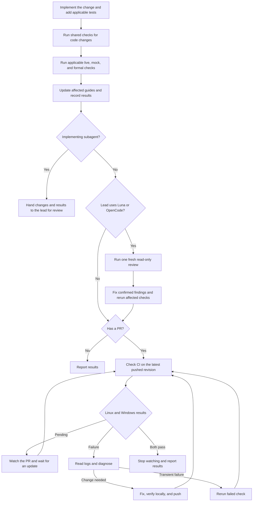

# Verification loop

See the [validate skill](../.agents/skills/validate/SKILL.md) for the procedure.

```mermaid
flowchart TD
    A[Implement the change and add applicable tests] --> B[Run shared checks for code changes]
    B --> C[Run applicable live, mock, and formal checks]
    C --> D[Update affected guides and record results]
    D --> Q{Implementing subagent?}
    Q -->|Yes| R[Hand changes and results to the lead for review]
    Q -->|No| E{Lead uses Luna or OpenCode?}
    E -->|Yes| F[Run one fresh read-only review]
    F --> G[Fix confirmed findings and rerun affected checks]
    E -->|No| H{Has a PR?}
    G --> H
    H -->|No| I[Report results]
    H -->|Yes| J[Check CI on the latest pushed revision]
    J --> K{Linux and Windows results}
    K -->|Pending| L[Watch the PR and wait for an update]
    L --> J
    K -->|Failure| M[Read logs and diagnose]
    M -->|Change needed| N[Fix, verify locally, and push]
    M -->|Transient failure| O[Rerun failed check]
    N --> J
    O --> J
    K -->|Both pass| P[Stop watching and report results]
```
