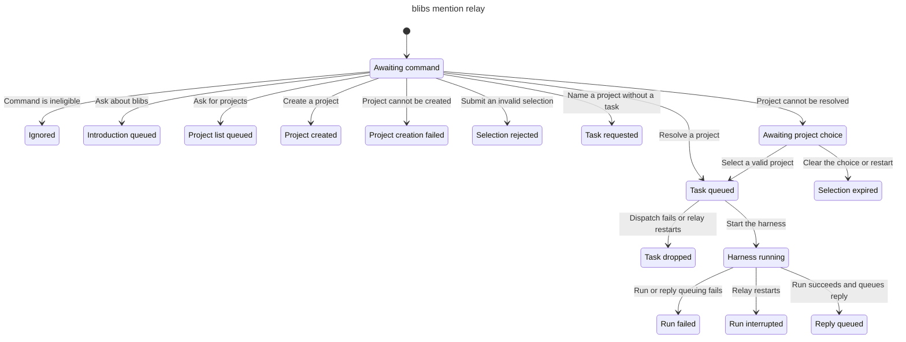

# Mention relay statechart

The chart shows one request. It omits steps that leave the request phase unchanged.

```mermaid
---
title: "blibs mention relay"
---
stateDiagram-v2
  s0: Awaiting command
  s1: Ignored
  s2: Introduction queued
  s3: Project list queued
  s4: Project created
  s5: Project creation failed
  s6: Selection rejected
  s7: Task requested
  s8: Task queued
  s9: Awaiting project choice
  s10: Task dropped
  s11: Selection expired
  s12: Harness running
  s13: Run failed
  s14: Run interrupted
  s15: Reply queued
  [*] --> s0
  s0 --> s1: Command is ineligible
  s0 --> s2: Ask about blibs
  s0 --> s3: Ask for projects
  s0 --> s4: Create a project
  s0 --> s5: Project cannot be created
  s0 --> s6: Submit an invalid selection
  s0 --> s7: Name a project without a task
  s0 --> s8: Resolve a project
  s0 --> s9: Project cannot be resolved
  s8 --> s10: Dispatch fails or relay restarts
  s8 --> s12: Start the harness
  s9 --> s11: Clear the choice or restart
  s9 --> s8: Select a valid project
  s12 --> s13: Run or reply queuing fails
  s12 --> s14: Relay restarts
  s12 --> s15: Run succeeds and queues reply
```
